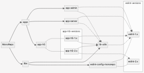

# MonoRepo design

分析研究大仓的管理设计方案。

## 假定工程结构
```
├── apps
│   ├── app-admin
│   ├── app-h5
│   │   ├── app-h5-1.x (版本)
│   │   └── app-h5-2.x (版本)
│   └── app-server
└── libs
    ├── eslint-config-monorepo
    │   ├── eslint-1.x (版本)
    │   └── eslint-2.x (版本)
    └── lib-utils
```

## 依赖关系

